

<h1 align="center">HelenHands</h1>

<strong>The HelenHands project emerges as a pioneering mobile application designed to
tackle the intricate challenges faced by individuals in communication, navigation,
and health management. In a landscape marked by diversity, the project aims to
deliver an equitable and inclusive user experience in an increasingly dynamic
world.</strong>

</img>

<h2>About</h2>
The unique needs of individuals with visual, hearing, or speech impairments are
catered to by the proactive approach through the development and evaluation of
HelenHands, an Android application Tool. The application tool offers a range of
features, including the Virtual White Cane for enhanced spatial awareness, Let's Chat
for real-time sign language translation, SOS Reach for emergency assistance, and the
Wellness Aware-Enabler for promoting proactive health behaviors. The
implementation process consists of six stages, each focusing on different aspects of
the application tool's functionality and usability. Evaluation of the machine learning
models used in the Let's Chat module reveals promising results, with a focus on
translating fingerspelled sign language to text in real-time. The research outcome
demonstrates significant advancements in technology's ability to improve accessibility
and user experiences for diverse populations. Through rigorous testing and analysis,
the HelenHands software tool exhibits robust performance across various modules,
ensuring reliability and functionality in real-world scenarios. Overall, HelenHands
represents a noteworthy effort in addressing accessibility challenges and fostering
inclusivity through innovative digital engagement. This research contributes to the
ongoing discourse on technology's role in enhancing user empowerment and
promoting diversity in digital spaces.

<h2>Aims and Objectives</h2>

-   Ensuring Safety and Emergency Response

- Comprehensive User Interface Design

- Adaptive Machine Learning Integration

- Community Support and Engagement

<h2>Requirements</h2>

* Android Minimum Software Development Kit of 28.
* Working Back Camera of the Phone to be Used.
* Working Front Camera of the Phone to be Used.
* Active Internet Connection Required

<h2>Key learnings</h2>

- Real-time navigation and obstacle detection via machine learning through integration of TensorFlow Lite enabling accurate object detection for obstacle avoidance and navigation
- Utilization of Google Teachable Machines and ML-Kit's Translate API in Training a Machine Learning Model, facilitating real-time translation, and fostering inclusive communication.
- Triggering phone call(s) based on audio and/or on-click events occuring using Kotlin.
- Implementing Periodic Reminders using Kotlin.
- Using an Amazon Web Services EC2 Instance as a Server, for a specific Module.
- Implementing Python Code to utlize the trained Machine Learning Model.

<h2>Technical Stack</h2>

1. TensorFlow Lite - Real-Time Object Detection Model
2. Google Teachable Machines - For Training the Sign Language-to-Text Conversion Machine Learning Model
3. ML Kit (involving Firebase) -  Translate API
4. Cloud Service Provider: Amazon Web Services
 Amazon EC2 Instance

Integrated Development Environment (IDE): Android Studio

Languages: Kotlin and Python

<h2>Module Descriptions</h2>

| Module  | Description |
| ------------- |:-------------:|
| Virtual White Cane      | The Virtual White Cane module is crafted to aid users in real-time navigation and obstacle detection, providing a safer and more confident way to traverse their surroundings. Leveraging the Real-Time Object Detection Module from TensorFlow Lite, the application detects obstacles and provides audio outputs to inform users about the closest detected object's distance and direction. Users' mobile devices serve as their virtual white cane, allowing them to navigate intuitively with the assistance of machine learning algorithms. Key data managed within this module includes user location data, object detection metrics, user preferences, and historical navigation patterns.     |
| Let's Chat      | The Let's Chat module is designed to facilitate seamless communication by integrating real-time translation capabilities, particularly from sign language to English. Powered by Google Teachable Machines for hand sign recognition and ML-Kit's Translate API for language translation, this module enables users to converse effortlessly. By training machine learning models with a dataset comprising hand sign images, the application translates sign language gestures into corresponding text, ensuring inclusivity in communication. Data management for this module encompasses hand sign images, translated text data, user language preferences, and communication history.     |
| SOS Reach     | The SOS Reach module serves as an emergency aid system, allowing users to request assistance swiftly. By harnessing machine learning technologies to enhance response times and accuracy, the application streamlines the process of seeking help during emergencies. Crucial data stored within this module includes user emergency contact information, real-time location data, emergency response details, and a log of SOS requests. Through efficient data management and seamless integration with emergency services, this module ensures users receive prompt assistance when needed.     |
| Wellness-Aware Enabler    | The Wellness Aware-Enabler module promotes users' well-being by providing gentle reminders at regular intervals. Encouraging hydration and mindful breathing, this module fosters a healthier lifestyle for users. Data management within this module encompasses user wellness preferences, reminder details, and feedback mechanisms. By delivering timely reminders tailored to individual needs, the application empowers users to prioritize their health and well-being. Through continuous engagement and user feedback, this module contributes to a holistic approach to personal wellness within the HelenHands.|

<h2>Screenshots</h2>

* Project Portfolio Website

  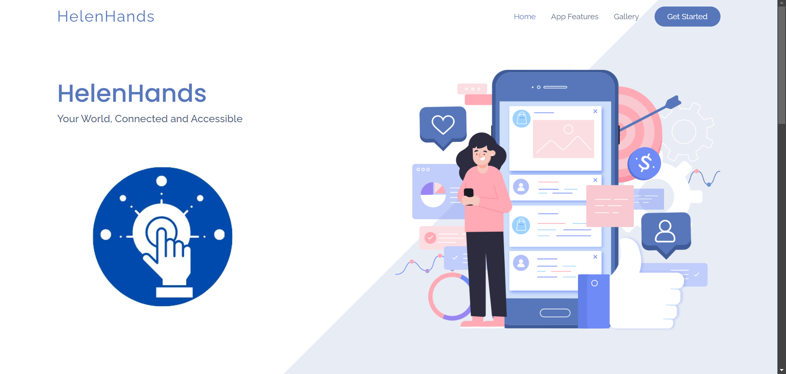
  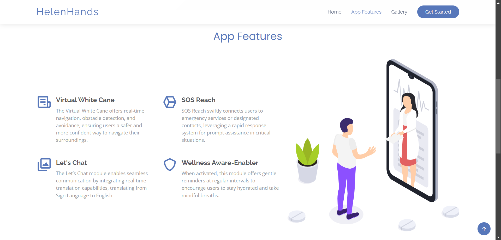
   
  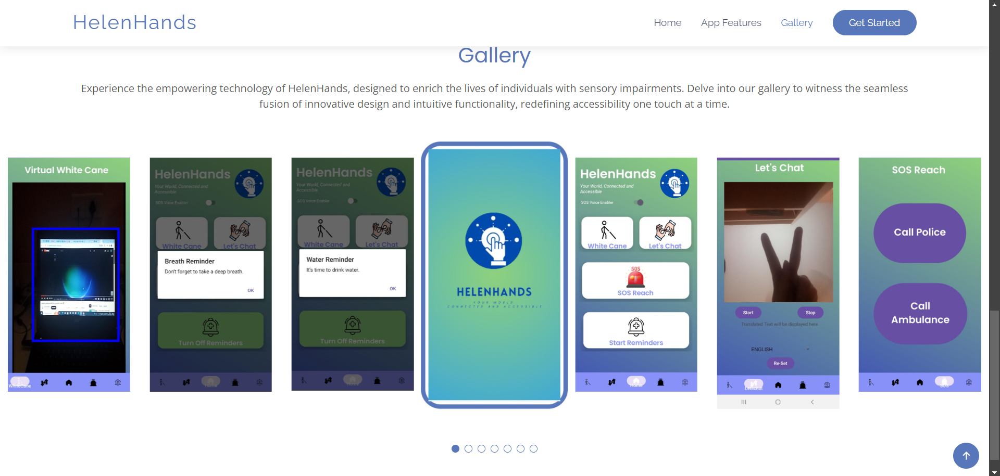

* Mobile Application: Splash Screen and Dashboard

  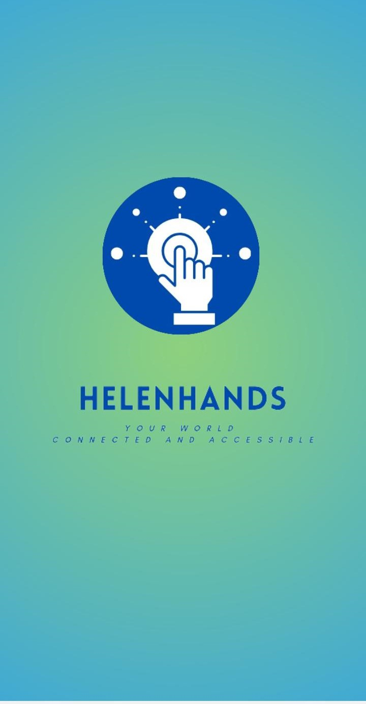
  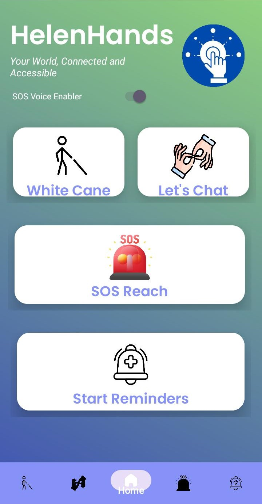

* Modules: Virtual White Cane
 

  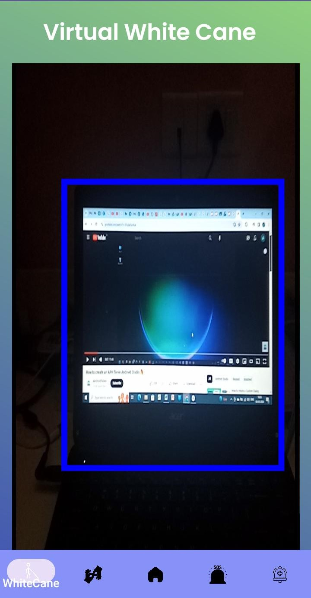
 

  
* Modules: Let's Chat
  

  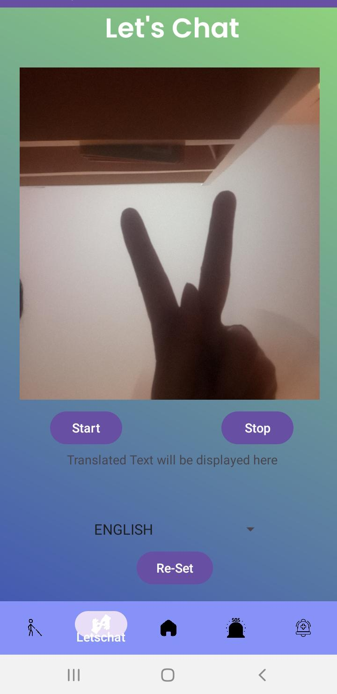
  

  
* Modules: SOS Reach
  

  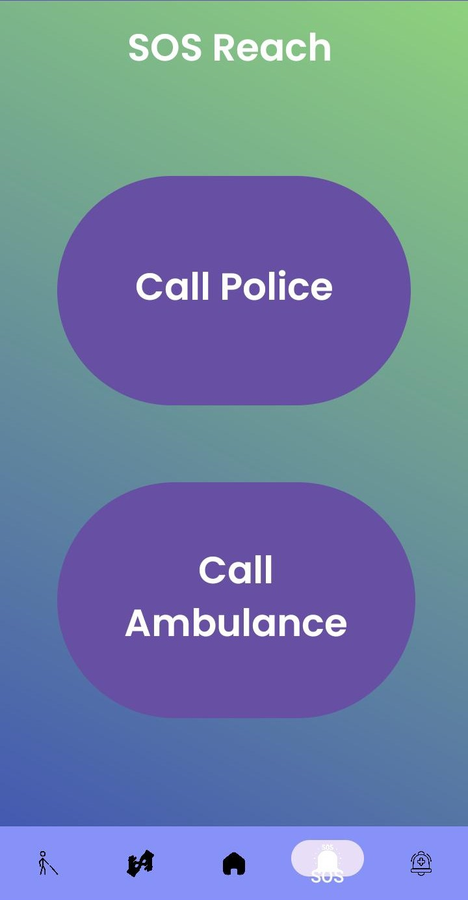
 

 
* Modules: Wellness-Aware Enabler
  

  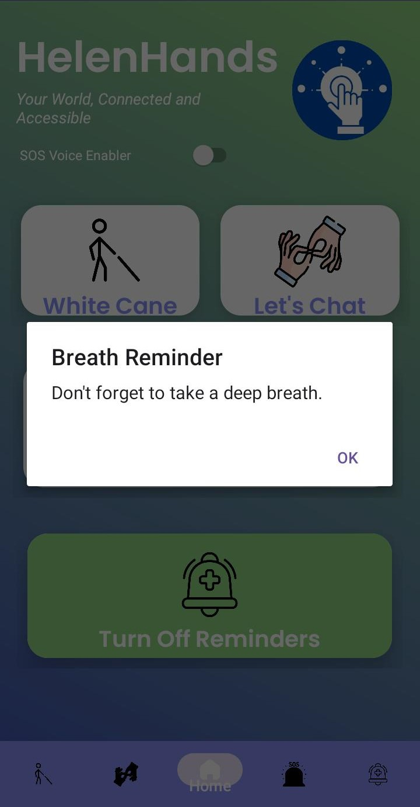
  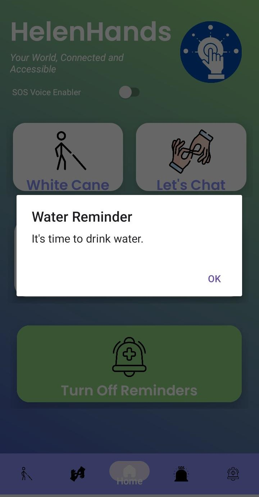

* Performance of Machine Learning Model Implemented in Let's Chat Module
  

  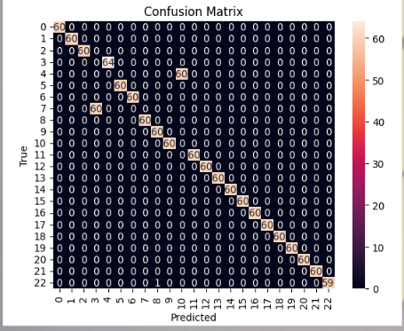
 

  
<h2>Presented at International Conference on Sustainable Advanced Computing 2024</h2>
This project is licensed under the terms of the MIT license and protected by Udacity Honor Code and Community Code of Conduct. See <a href="LICENSE.md">license</a> and <a href="LICENSE.DISCLAIMER.md">disclaimer</a>.
Thank you.

